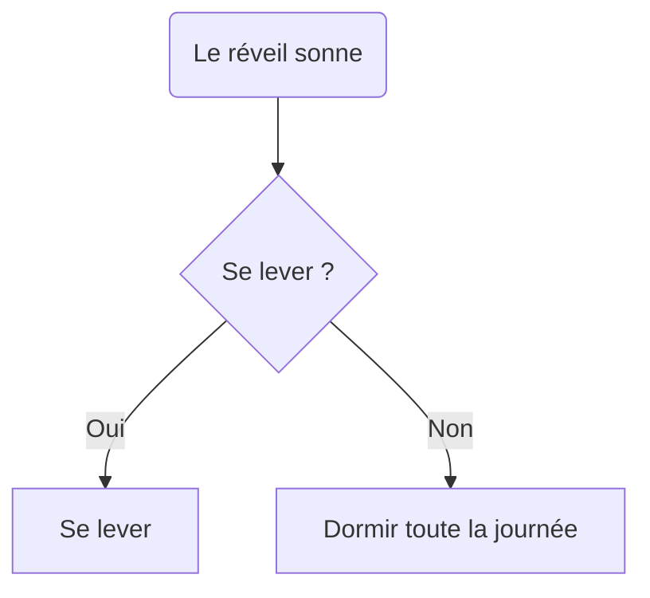

# Algorithme du café

Dessiner un diagramme  qui modélise la procédure de réveil d'un
professeur au collège. Par exemple, un simple diagramme pour modéliser
une décision oui/non serait le suivant:

## Procédure

**🛌 Le réveil**

- Le réveil sonne.
- Le professeur décide s’il se lève ou appuie sur "snooze" pour dormir encore 5 minutes.

**⚙️ La préparation du café**

- Le professeur vérifie s’il reste du café moulu.
    - Si non, faire un aller-retour à l’épicerie et continuer la routine.
- Il ajoute de l’eau dans la cafetière.
- Il ajouter du café.
- Il démarrer la cafetière.
- Il fixe impatiemment la machine.

**☕ La dégustation**

- Le professeur goûte le café.
- Si le café est bon, il peut commencer sa journée.
- Si le café est mauvais, il peut soit :
    - Tenter un deuxième café,
    - Ajouter du lait ou du sucre et commencer sa journée.

## Solution sous forme de diagramme

Afficher la solution

export const d1 = `
flowchart TD
    A[Le réveil sonne] --> B{Se lever ?}
    B -- Oui --> C[Se lever]
    B -- Non --> Z[Snooze pendant 5 min] --> A

    C --> D{Y a-t-il du café moulu ?}
    D -- Non --> E[Aller à l'épicerie]
    E --> G

    D -- Oui --> G[Ajouter de l'eau à la cafetière]
    G --> H[Ajouter du café]
    H --> I[Démarrer la cafetière]
    I --> J[Regarder fixement la cafetière]
    J --> L[Le café est prêt]

    L --> M{Est-il bon ?}
    M -- Oui --> N[Commencer la journée avec enthousiasme]
    M -- Non --> O{Réessayer ?}
    O -- Oui --> G
    O -- Non --> P[Ajouter du lait/sucre]
    P --> N
`

<WithMermaidCode code={d1} />

