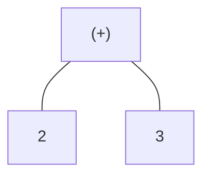
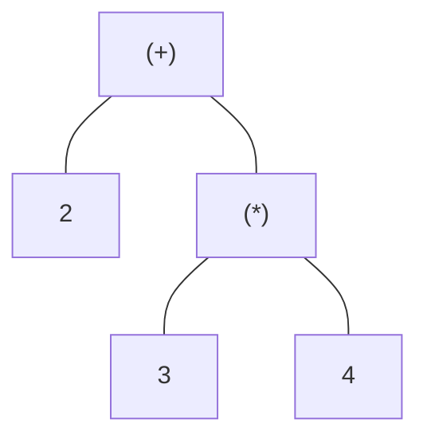
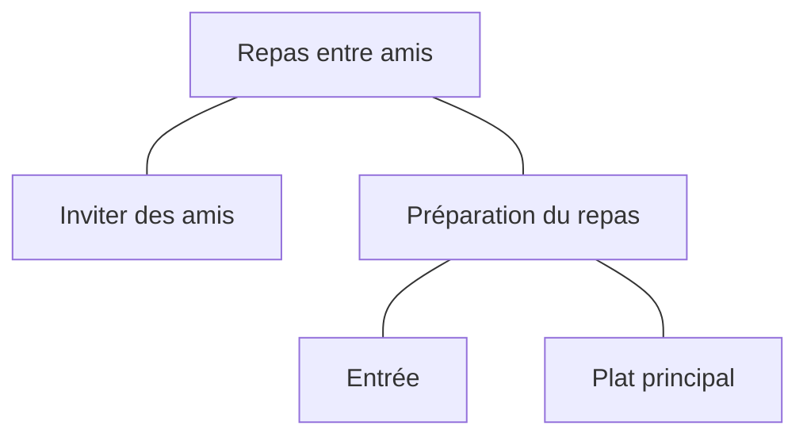

# Évaluateur arithmétique

Les languages de programmation sont des langages formels qui permettent de
décrire des algorithmes. Ils sont composés d'un ensemble de règles syntaxiques
et sémantiques qui définissent comment écrire des instructions et comment les
interpréter. La syntaxe définit comment écrire les instructions, tandis que la
sémantique définit comment interpréter ces instructions.

## Arbre syntaxique

Les règles les plus simples sont en générales celles des expressions
constituées de constantes et opérateurs. La syntaxe est simple, la
même que celle apprise en mathématique au secondaire. Par exemple, l'expression
`2 + 3` est une expression qui additionne deux constantes. Toutefois, il est
très difficile de travailler directement sur une chaînes de caractères. Ainsi,
la première étape de l'évaluation consiste à transformer une chaîne de
caractères en une structure de données qui peut être manipulée plus facilement.

On utilise dans la majorité des cas un arbre syntaxique pour représenter la structure
d'une expression. Un peu comme l'image d'un arbre généalogique, un arbre syntaxique
représente la hiérarchie des opérations dans une expression. Il y a un noeud racine
qui représente l'opération à effectuer en dernier et ensuite des enfants de ce noeud qui
représentent les opérations à effectuer avant. Il peut y avoir plusieurs niveaux
de profondeur pour plusieurs opérations à faire en étapes.

Par exemple, l'expression `2 + 3` peut être représentée par l'arbre ci-dessous.
L'opération `+` est la racine de l'arbre et les deux enfants sont les
constantes `2` et `3`.



:::tip

Les enfants d'un noeud représentent les informations nécessaires pour
effectuer l'opération de ce noeud. Donc on peut lire un arbre syntaxique
de la façon suivante : Si j'ai le résultat de mes enfants, je peux
effectuer mon calcul. Il devient alors clair que l'opération à la racine
est en fait la dernière à être calculé.

:::


L'expression `2 + 3 * 4` peut être représentée par l'arbre ci-dessous.
L'opération `+` est la racine de l'arbre, car il faut d'abord faire la
multiplication de façon à respecter l'ordre de priorité des opérations.
Donc la multiplication est un enfant de l'opération `+` et les
deux enfants de la multiplication sont les constantes `3` et `4`.



Tel que vu dans les deux exemples précédents, l'arbre syntaxique se
termine toujours par des constantes. C'est logique, il faut bien
avoir des valeurs pour effectuer des calculs.

### Comme une liste de tâches

Si vous avez déjà fait une liste de tâches avec des sous-tâches, vous
avez déjà utilisé un arbre syntaxique. Par exemple, si vous voulez
manger un bon repas avec vos amis, vous devez les inviter et le préparer.
La préparation du repas est en fait elle-même divisée en plusieurs étapes, par exemple
préparer l'entrée et le plat principal.



Comme vous pouvez le voir, cette liste de tâches avec sous-tâches est visuellement
la même chose que l'arbre syntaxique de l'expression `2 + 3 * 4`.


## Évaluation d'un arbre syntaxique

Puisque les enfants d'un noeud représentent les informations nécessaires
pour effectuer l'opération de ce noeud, on peut évaluer un arbre syntaxique
en parcourant l'arbre de bas en haut. On commence par évaluer les
feuilles de l'arbre, c'est-à-dire les noeuds qui n'ont pas d'enfants. Dans le cas
de constantes arithmétiques, il est trivial de les évaluer, car elles
représentent déjà leur propre valeur. Ensuite on remplace chaque noeud
par la valeur de l'opération qu'il représente. On continue ainsi jusqu'à
ce qu'il ne reste plus qu'un seul noeud, la racine de l'arbre. Ce noeud
est la valeur de l'expression.

L'expression `2 + 3 * 4` peut être évaluée de la façon suivante. Étape 1 on
évalue les feuilles de l'arbre, c'est-à-dire les constantes `2`, `3` et `4`.
Visuellement, l'arbre ne change pas, car les constantes sont déjà des valeurs.
Étape 2 on évalue l'opération `*` en multipliant les deux constantes `3` et
`4`. On obtient donc un résultat de `12` et un arbre modifié. Étape 3 on évalue
l'opération `+` en additionnant la constante `2` et `12` (le résultat de
l'opération `*`). 

Ces trois étapes peuvent être représentées par les trois arbres
suivants. Les noeuds en jaune représentent les noeuds qui ont sont évalués.

<Tabs>
    <TabItem value="step_1" label="Étape 1">
    ```mermaid
    graph TD
        
        A["(+)"] --- B[2]
        A --- C["(*)"]
        C --- D[3]
        C --- E[4]

        classDef yellow fill:#ffff99,stroke:#333,stroke-width:1px;

        class B,D,E yellow;
    ```
    </TabItem>
    <TabItem value="step_2" label="Étape 2">
    ```mermaid
    graph TD
        
        A["(+)"] --- B[2]
        A --- C[12]

        classDef yellow fill:#ffff99,stroke:#333,stroke-width:1px;

        class B,C yellow;
    ```
    </TabItem>
    <TabItem value="step_3" label="Étape 3">
    ```mermaid
    graph TD
        
        A[14]
        classDef yellow fill:#ffff99,stroke:#333,stroke-width:1px;

        class A yellow;
    ```
    </TabItem>
</Tabs>