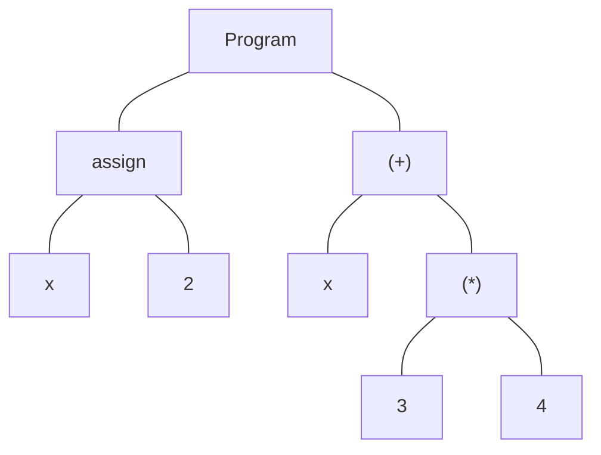

# Évaluateur avec variables

Les variables sont des symboles qui représentent une valeur. Elles sont
utilisées pour stocker des résultats intermédiaires ou pour représenter des
valeurs.

## Environnement
Avec le concept de variables vient celui d'environnement. Un environnement
est une structure de données qui associe des variables à des valeurs. C'est
en quelque sorte une table de correspondance entre le nom des variables et les
valeurs qu'elles représentent. La façon la plus simple de représenter une telle
table est d'utiliser une liste de tuples (nom, valeur). Par exemple, si
l'environnement contient la variable `x` qui vaut `2` et la variable `y` qui
vaut `3`, l'environnement peut être représenté par la liste suivante en Python:

```python
[("x", 2), ("y", 3)]
```

Pour rechercher la valeur d'une variable dans un environnement, il suffit de
parcourir la liste et de retourner la valeur associée au nom de la variable.
Si la variable n'est pas trouvée, il faut retourner une erreur. La fonction
`lookup` ci-dessous effectue cette tâche.

```python
from typing import Any

def lookup(env: list[str, Any], var: str) -> Any:
    """
    Cherche la valeur de la variable `var` dans l'environnement.
    L'environnement est une liste de paires (nom, valeur), la première occurrence l'emporte.
    """
    for name, value in env:
        if name == var:
            return value
    raise NameError(f"La variable '{var}' n'est pas définie.")
```

Lorsqu'une nouvelle variable est définie, il faut l'ajouter à
l'environnement. La fonction `assign` ci-dessous ajoute une nouvelle
variable à l'environnement. Si la variable existe déjà, elle est
remplacée par la nouvelle valeur. La fonction `assign` retourne un
environnement mis à jour.

```python
def assign(env: list[tuple[str, Any]], var: str, value: Any) -> list[tuple[str, Any]]:
    """
    Retourne un nouvel environnement où `var` est liée à `value`.
    La nouvelle liaison est ajoutée en tête.
    """
    return [(var, value)] + env
```

:::info

Il peut sembler inefficace d'utiliser une liste de tuples pour représenter un
environnement, car la recherche d'une variable prend un temps linéaire et
`assign` pourrait même dupliquer des entrées pour un même nom. Un dictionnaire
éviterait ces problèmes.

Touefois, pour des environnements de petite taille, cette approche est simple
et surtout permet de bien comprendre le concept d'environnement, de masquage de
variables et de portée locale et de portée globale qui seront abordés
dans la suite de ce cours. De plus, une liste vous donne l'ordre d'insertion
ce qui est précieux pour débugger et comprendre le comportement de votre code.

:::

## Évaluation d'expressions avec variables

L'évaluation d'expressions avec des variables est similaire à l'évaluation
d'expressions sans variables, mais il faut tenir compte de l'environnement pour
évaluer les variables. Lorsqu'une variable est rencontrée dans une expression,
il faut rechercher sa valeur dans l'environnement. Par définition, ceci est la
sémantique de l'évaluation des variables.

Ainsi, si l'environnement contient la variable `x` qui vaut `2`, l'expression
`x + 3 * 4` sera évaluée de la façon suivante. Pour rappel les noeuds en jaune
sont ceux qui sont en cours d'évaluation.

<Tabs>
    <TabItem value="step_1" label="Étape 1">
    ```mermaid
    graph TD
        
        A["(+)"] --- B[x]
        A --- C["(*)"]
        C --- D[3]
        C --- E[4]

        classDef yellow fill:#ffff99,stroke:#333,stroke-width:1px;

        class B,D,E yellow;
    ```
    </TabItem>
    <TabItem value="step_2" label="Étape 2">
    ```mermaid
    graph TD
        
        A["(+)"] --- B[2]
        A --- C[12]

        classDef yellow fill:#ffff99,stroke:#333,stroke-width:1px;

        class B,C yellow;
    ```
    </TabItem>
    <TabItem value="step_3" label="Étape 3">
    ```mermaid
    graph TD
        
        A[14]
        classDef yellow fill:#ffff99,stroke:#333,stroke-width:1px;

        class A yellow;
    ```
    </TabItem>
</Tabs>

On remarque qu'à l'étape 2, la variable `x` a été remplacée par sa valeur
`2`. L'évaluateur a utiliser la fonction `lookup` pour rechercher la valeur de
`x` dans l'environnement.

## Assignation de variables et instructions

L'évaluation d'expressions avec des variables est un bon début, mais il faut
aussi pouvoir assigner des valeurs à des variables. Il est très mélangeant
d'ajouter l'assignation de variables directement dans la syntaxe des
expressions. En Python, il est possible d'utiliser l'opérateur `:=` pour le
faire. Mais l'expression suivante  `(x := 2) + 3 * x` est
difficile à lire et à comprendre pour un débutant. En plus, l'expression `x + 3 * (x := 2)` est une erreur.

Il est donc plus judicieux de séparer l'assignation de variables des
expressions. Pour ce faire, on peut utiliser une **instruction** qui permet
d'assigner une valeur à une variable. On ajoute donc un nouveau concept, soit
celui d'instruction. Une instruction est une opération qui modifie le
comportement de l'évaluateur. Les boucles, les conditions et l'assignation de
variables sont des instructions. Elles ne retournent pas de valeur, mais
modifient l'état de l'évaluateur.  Les instructions souvent contiennent
des expressions. Ainsi, un programme devient une série d'instructions qui sont
exécutées de façon séquentielle.

Ainsi, le programme suivant en Python:

```python
x = 2
x + 3 * 4
```

pourrait être représenté par l'arbre syntaxique suivant:



La particularité du noeud `Program` est qu'il contient une liste
d'instructions. Il les exécutes *séquentiellement* et retourne la valeur de la
dernière instruction. Dans un évaluateur simple, le programme démarre avec un 
environnement vide. Dans un évaluateur plus complexe, il peut y avoir un
environnement global déjà défini.